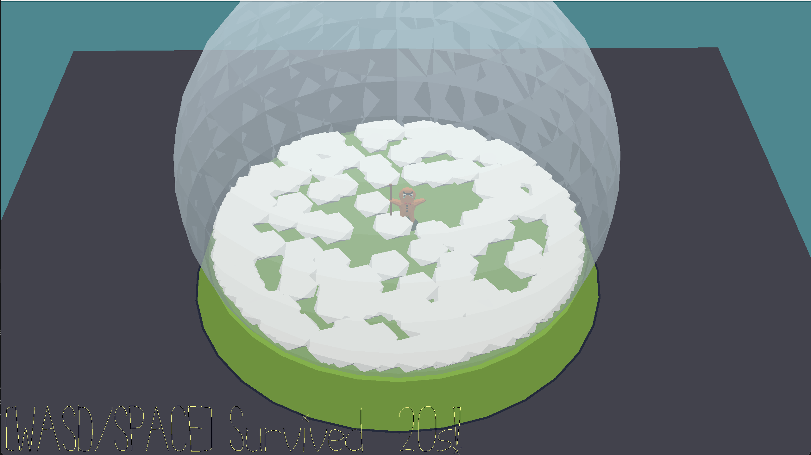

# Snowswop

**Author**: Runkun Chen (runkunc)

**Design**: A sloppy 3D arcade game about a cookie man (or gingerbread) sweeping snow inside a snow globe. The cookie man needs to sweep the snow to stay warm, but somebody keeps shaking that snow globe... And snow keeps accumulating. Try to survive as long as possible before you got buried.

**Screen Shot**:



The game is themed around a snow globe because... snow globe..., but also because it has a very simple geometry.

One design goal of the game is to make it feel physic-y, while avoiding writing *any* physics/collision code. The geometry of everything in the game is simple enough so that I need not write AABB/raycasting/anything like that; just `glm::length()` for everything. Same reason the player is a cookie: I don't need to animate the limbs because it is a cookie.

#### How To Play

- **Space**: Proceed through intro / sweep
- **WASD/Arrows**: Move
- **R**: Reset game after game over

Build and play:
```bash
# Recompile then play
node Maekfile.js && ./dist/game
# Or, rebuild assets, then recompile and play
make -C scenes && node Maekfile.js && ./dist/game
```

----

Google, StackOverflow, and GL online documentations helped me a lot on using OpenGL (especially with transparency) and doing geometry. Blender was used to create the 3D assets.

This game was built with [NEST](NEST.md).
